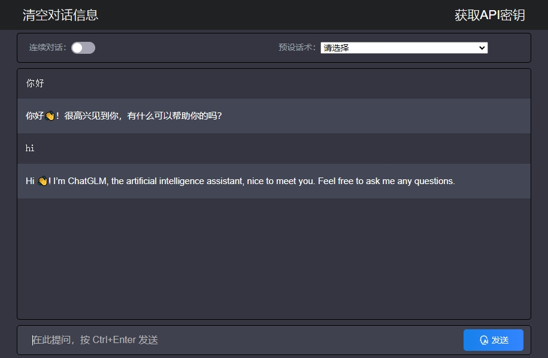

# chatglm_php
基于chatgpt(php)项目，适配了ZhiPu智谱AI官方大语言模型chatGLM在线API聊天接口的php调用demo。

# 原作者项目：https://github.com/dirk1983/chatgpt
------
**版本特性，来自原作者更新日志：**

1. 支持多行输入，文本框高度自动调节
2. AI回答途中可以随时打断
3. 增加了一些预设话术
4. 对手机浏览器进行了适配优化
5. 修复了AI回复内容包含某些代码时，显示效果异常的bug
6. 增加了代码复制按钮
7. 支持表格和公式的显示
8. 优化了代码显示逻辑

------

**由于国内环境使用OpenAI官方接口Chatgpt不太方便，而且目前国产大模型效果也越来越强，
所以基于大佬的代码适配了PHP版调用ZhipuAI的API接口进行问答的Demo，代码默认为调用GLM-4-Flash免费模型，
是智谱AI首个免费大模型API，兼具“高速度”和“经济性”两大特点，支持128K上下文。**

1. 采用Stream流模式通信，一边生成一边输出，响应速度快。
注：PHP如果运行后没有流式输出效果，需要关闭输出缓冲，需要修改apache或nginx及php.ini的配置。
2. 前端采用JS的EventSource，还将Markdown格式文本进行了排版，对代码进行了着色处理。
3. 服务器记录所有访问者的对话日志和IP地址，方便管理员查询。
4. 核心代码只有几个文件，没有用任何框架，修改调试很方便。
5. 为了美观可以把上面的“连续对话”部分注释掉，这样对手机访问更友好。
6. index.php前面的代码还可以实现区分内外网IP，内网直接访问，外网通过BASIC认证后可访问。可以根据需要删掉注释并进行修改。

目前并没有适配支持chatglm的错误处理，接口返回错误时看不到具体原因。 
https://open.bigmodel.cn/dev/api/error-code/error-code-v4

------

**部署使用说明：**
1. 确保服务器php版本为5.6.9以上，实测5.2.17不支持。
2. 修改stream.php中第9行的OPENAI_API_KEY为你的_api_key。
3. （可选）如需使用其它对话模型，如glm-4-0520，在模型广场查到模型编码后，修改setsession.php中第4行model项目"glm-4-flash"为你的模型名称代码。

------

**智谱AI官网的模型和接口调用介绍：**

模型广场（模型编码） 
https://open.bigmodel.cn/console/modelcenter/square 
接口文档（HTTP调用） 
https://open.bigmodel.cn/dev/api/normal-model/glm-4 
API密钥Key 
https://open.bigmodel.cn/usercenter/apikeys
